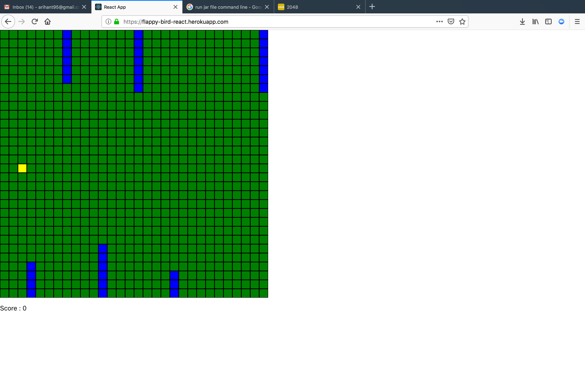

# Flappy-bird-react
A flappy bird game with only ReactJS. No game engine involved.


### Installation Steps
```
cd flappy-bird-react
npm install
npm start
```
open the url [http://localhost:3000/](http://localhost:3000/)

### Screenshots


### Controls
Press `space-bar` to jump

### Live Play
[https://flappy-bird-react.herokuapp.com/](https://flappy-bird-react.herokuapp.com/)

**Note:** The free heroku engine sometimes throws an error. Reloading the page sometimes fixes the issue.

### Next Steps
- Beautification with better graphics
- Animations
- Introduction of AI for increasing difficulty level


### Inspiration
[Flappy Bird](https://flappybird.io/)
